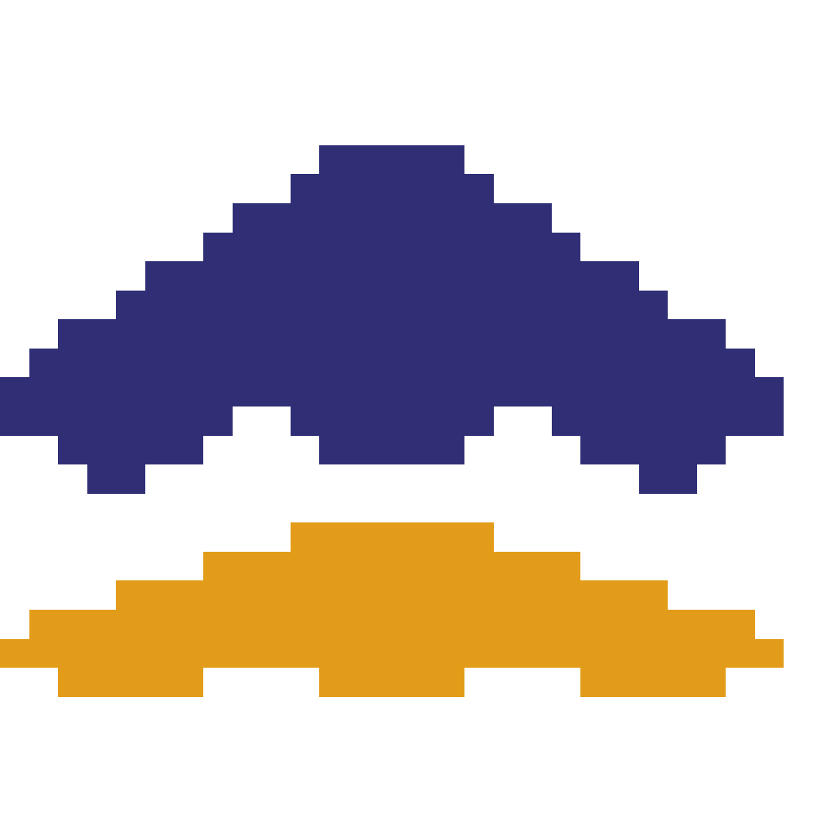

[English](README.md) · **Português**

<picture>
  <source media="(prefers-color-scheme: dark)" srcset="../docs/brand/assets/logo/logo-dark.svg">
  
</picture>

# OGS tech

**Tecnologia que leva o seu negócio além.**

`Your business. Further. Future-Ready.`

Tecnologia de qualidade não deveria ser privilégio de empresa grande.
Construímos IA aplicada, software sob medida e open source pra que pequenas
e médias empresas cresçam sobre tecnologia que se sustenta.

---

## O que construímos

Três marcas, um guarda-chuva.

### 🤝 OGS Partners — *premium, feito pra você*

Engenharia e suporte dedicados. A OGS disponibiliza um time completo —
arquitetura, desenvolvimento e continuidade — e entrega o projeto. O melhor:
não desaparece depois.

| Projeto | |
|---|---|
| **Alephee** | Plataforma de integração com marketplaces — serviços core, SDK e adapters de vendor, automação de QA · `privado` |
| **Noordhen** | Plataforma de operações sob medida da Noordhen Brasil, mais o suporte contínuo · `privado` |

### 🏭 OGS Studio — *escalável, já funcionando*

Produtos empacotados que já existem e já rodam. Você contrata uma solução
testada em vez de financiar um projeto do zero.

| Projeto | |
|---|---|
| **Royale IQ** | Coach com IA para jogadores de Clash Royale, movido a Agent AI · `privado` |

### ⚙️ OGS Engine — *a sala de máquinas*

A OGS constrói as próprias ferramentas. Por isso a entrega sai rápida sem ser
improvisada: boa parte da fundação já está pronta, testada e aberta.

| Projeto | |
|---|---|
| [**Press**](https://github.com/ogs-tech/press) | CLI para sites de conteúdo em **Strapi 5 + Next.js**, com a stack inteira entregue como dependência versionada e atualizável — você mantém uma camada fina de configuração, o `press` materializa o resto |
| [**IA Companion**](https://github.com/ogs-tech/ai-companion) | App de desktop que centraliza as customizações de IA — skills, perfis de agente, instruções globais, comandos — em Markdown + YAML e as sincroniza com o **Claude Code** |

> Os itens marcados `privado` são trabalho de cliente ou pré-lançamento. Os
> repositórios são fechados, então o nome vai sem link em vez de apontar pra
> um 404.

📚 Hub de documentação: [todos os produtos, organizados por marca](https://github.com/ogs-tech/.github/blob/main/docs/README.pt-BR.md)
➡️ Arquitetura de marca: [como o guarda-chuva se conecta](https://github.com/ogs-tech/.github/blob/main/docs/explanation/brand-architecture.md)

---

## Onde a marca se apoia

| | |
|---|---|
| **Missão** | Tecnologia que leva o seu negócio além. |
| **Propósito** | Tecnologia de qualidade não deveria ser privilégio de empresa grande. |
| **Visão** | Ser a maior empresa de tecnologia pra pequenas e médias empresas do Brasil. |
| **Valores** | Lideramos com ética, crescemos juntos. |

PT · EN não é tradução de fachada — é como a marca pensa, contrata e documenta.

Detalhe completo: [Missão, Propósito, Visão, Valores e Slogan](https://github.com/ogs-tech/.github/blob/main/profile/about/README.pt-BR.md) ·
[Organograma](https://github.com/ogs-tech/.github/blob/main/profile/about/README.pt-BR.md#organograma)

---

## Foco

- IA aplicada e agentes autônomos
- SaaS escalável
- Open source

---

## Contato

**[www.useogs.com](https://www.useogs.com)** · [contato@useogs.com](mailto:contato@useogs.com) · São Paulo, Brasil
