# About OGS Tech

## Mission

Technology that takes your business further.

---

## Purpose

We believe quality technology should not be a privilege of large companies.

---

## Vision

To be the largest technology company for small and medium businesses in Brazil.

---

## Values

We lead with ethics, we grow with people.

---

## Slogan

Your business. Further. Future.

---

## Organizational Chart

```mermaid
%%{init: {"flowchart": {"nodeSpacing": 60, "rankSpacing": 180, "diagramPadding": 40, "useMaxWidth": true}}}%%
flowchart TB

    CEO["CEO / Founder<br/>Odenir Gomes"]

    %% C-LEVEL
    CTO["CTO<br/>Technology<br/>Odenir Gomes"]
    CPO["CPO<br/>Product<br/>Odenir Gomes"]
    COO["COO<br/>Operations<br/>Odenir Gomes"]
    CFO["CFO<br/>Finance<br/>Odenir Gomes"]
    CCO["CCO<br/>Commercial<br/>Odenir Gomes"]

    CEO --> CTO
    CEO --> CPO
    CEO --> COO
    CEO --> CFO
    CEO --> CCO

    %% TECHNOLOGY
    subgraph TECHNOLOGY
        ENG["Software Engineering<br/>Odenir Gomes"]
        ARCH["Architecture / SDE<br/>Odenir Gomes"]
        DEVOPS["DevOps / Infrastructure<br/>Odenir Gomes"]

        ENG --> BE["Backend<br/>Odenir Gomes"]
        ENG --> FE["Frontend<br/>Odenir Gomes"]
        ENG --> MOBILE["Mobile<br/>Odenir Gomes"]
        ENG --> QA["QA<br/>Odenir Gomes"]

        ARCH --> SDE["SDEs<br/>Odenir Gomes"]

        DEVOPS --> CLOUD["Cloud<br/>Odenir Gomes"]
        DEVOPS --> SRE["SRE<br/>Odenir Gomes"]
        DEVOPS --> SEC["Security<br/>Odenir Gomes"]
    end

    CTO --> ENG
    CTO --> ARCH
    CTO --> DEVOPS

    %% PRODUCT
    subgraph PRODUCT
        PM["Product Management<br/>Odenir Gomes"]
        DESIGN["UX/UI<br/>Odenir Gomes"]

        PM --> PMGR["PMs<br/>Odenir Gomes"]
        PM --> PO["POs<br/>Odenir Gomes"]

        DESIGN --> UX["UX<br/>Odenir Gomes"]
        DESIGN --> UI["UI<br/>Odenir Gomes"]
    end

    CPO --> PM
    CPO --> DESIGN

    %% OPERATIONS
    subgraph OPERATIONS
        CS["Customer Success<br/>Odenir Gomes"]
        SUPPORT["Support<br/>Odenir Gomes"]
        OPS["Processes<br/>Odenir Gomes"]
    end

    COO --> CS
    COO --> SUPPORT
    COO --> OPS

    %% FINANCE
    subgraph FINANCE
        FIN["Finance<br/>Odenir Gomes"]
        ACC["Accounting<br/>Odenir Gomes"]
        LEGAL["Legal<br/>Odenir Gomes"]
    end

    CFO --> FIN
    CFO --> ACC
    CFO --> LEGAL

    %% COMMERCIAL
    subgraph COMMERCIAL
        MKT["Marketing<br/>Odenir Gomes"]
        SALES["Sales<br/>Odenir Gomes"]

        MKT --> BRAND["Branding<br/>Odenir Gomes"]
        MKT --> PERF["Performance<br/>Odenir Gomes"]
        MKT --> CONTENT["Content<br/>Odenir Gomes"]

        SALES --> SDR["SDR<br/>Odenir Gomes"]
        SALES --> CLOSER["Closers<br/>Odenir Gomes"]
    end

    CCO --> MKT
    CCO --> SALES
```

