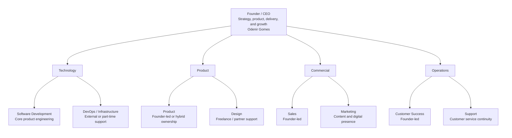

# About OGS Tech

## Mission

Technology that takes your business further.

---

## Purpose

We believe quality technology should not be a privilege of large companies.

---

## Vision

To be the largest technology company for small and medium businesses in Brazil.

---

## Values

We lead with ethics, we grow with people.

---

## Slogan

Your business. Further. Future.

---

## Organizational Chart

The chart below reflects OGS Tech's current early-stage structure, where some functions are founder-led or supported by external partners.

## Roles, Responsibilities, and Current Assignments

> This structure reflects OGS Tech's current early-stage operating model and can evolve as the company grows.

### Founder Leadership

| Role | Description | Responsibilities | Current Assignments |
|---|---|---|---|
| Founder / CEO | Leads the company's direction while directly supporting core functions. | Set priorities; represent the company; connect strategy with execution. | Vision, partnerships, delivery alignment, and growth decisions. |

### Technology

| Role | Description | Responsibilities | Current Assignments |
|---|---|---|---|
| Software Development | Builds and improves the company's core products and services. | Deliver features; maintain code quality; support releases. | Platform development, architecture decisions, and technical improvements. |
| DevOps / Infrastructure | Supports environments, deployment, and operational reliability. | Maintain infrastructure; automate workflows; improve stability. | Cloud setup, CI/CD, and part-time or external operational support. |

### Product and Design

| Role | Description | Responsibilities | Current Assignments |
|---|---|---|---|
| Product | Connects customer needs with delivery priorities and roadmap decisions. | Define priorities; validate opportunities; organize execution. | Founder-led product direction and hybrid product ownership. |
| Design | Supports usability, interfaces, and visual consistency when needed. | Improve user experience; shape screens; strengthen clarity. | Freelance or partner-based design support. |

### Commercial

| Role | Description | Responsibilities | Current Assignments |
|---|---|---|---|
| Sales | Turns opportunities into customer relationships and revenue. | Qualify leads; run conversations; close deals. | Founder-led sales, proposals, and commercial partnerships. |
| Marketing | Builds presence, credibility, and demand through focused communication. | Publish content; improve positioning; support growth efforts. | Light marketing execution focused on content and digital presence. |

### Operations and Customer Care

| Role | Description | Responsibilities | Current Assignments |
|---|---|---|---|
| Customer Success | Helps customers adopt solutions and maintain long-term value. | Onboard customers; follow up on results; support retention. | Founder-led relationship management for key accounts. |
| Support | Handles requests and keeps service continuity for clients. | Respond to issues; triage requests; coordinate fixes. | Customer support and service continuity. |
| Finance and Administration | Keeps financial and administrative routines organized. | Track cash flow; manage documents; support compliance. | Leadership oversight with external accounting support when needed. |
