# About OGS Tech

## Mission

Technology that takes your business further.

---

## Purpose

We believe quality technology should not be a privilege of large companies.

---

## Vision

To be the largest technology company for small and medium businesses in Brazil.

---

## Values

We lead with ethics, we grow with people.

---

## Slogan

Your business. Further. Future.

---

## Organizational Chart

The chart below presents OGS Tech's structure and a short description of each role.

```mermaid
%%{init: {"flowchart": {"nodeSpacing": 60, "rankSpacing": 180, "diagramPadding": 40, "useMaxWidth": true}}}%%
flowchart TB

    CEO["CEO / Founder<br/>Company vision and strategic direction<br/>Odenir Gomes"]

    %% C-LEVEL
    CTO["CTO<br/>Technology leadership and delivery<br/>Odenir Gomes"]
    CPO["CPO<br/>Product strategy and customer value<br/>Odenir Gomes"]
    COO["COO<br/>Operational efficiency and service quality<br/>Odenir Gomes"]
    CFO["CFO<br/>Financial planning and governance<br/>Odenir Gomes"]
    CCO["CCO<br/>Revenue growth and market expansion<br/>Odenir Gomes"]

    CEO --> CTO
    CEO --> CPO
    CEO --> COO
    CEO --> CFO
    CEO --> CCO

    %% TECHNOLOGY
    subgraph TECHNOLOGY
        ENG["Software Engineering<br/>Software delivery and code quality<br/>Odenir Gomes"]
        ARCH["Architecture / SDE<br/>Scalable systems and technical direction<br/>Odenir Gomes"]
        DEVOPS["DevOps / Infrastructure<br/>Platform reliability and automation<br/>Odenir Gomes"]

        ENG --> BE["Backend<br/>APIs and business logic<br/>Odenir Gomes"]
        ENG --> FE["Frontend<br/>Web interfaces and usability<br/>Odenir Gomes"]
        ENG --> MOBILE["Mobile<br/>Mobile apps and journeys<br/>Odenir Gomes"]
        ENG --> QA["QA<br/>Testing and release confidence<br/>Odenir Gomes"]

        ARCH --> SDE["SDEs<br/>System design and technical solutions<br/>Odenir Gomes"]

        DEVOPS --> CLOUD["Cloud<br/>Cloud foundation and deployment<br/>Odenir Gomes"]
        DEVOPS --> SRE["SRE<br/>Reliability, uptime, and observability<br/>Odenir Gomes"]
        DEVOPS --> SEC["Security<br/>Protection, compliance, and risk control<br/>Odenir Gomes"]
    end

    CTO --> ENG
    CTO --> ARCH
    CTO --> DEVOPS

    %% PRODUCT
    subgraph PRODUCT
        PM["Product Management<br/>Roadmap and product outcomes<br/>Odenir Gomes"]
        DESIGN["UX/UI<br/>Experience and interface quality<br/>Odenir Gomes"]

        PM --> PMGR["PMs<br/>Planning and prioritization<br/>Odenir Gomes"]
        PM --> PO["POs<br/>Backlog ownership and delivery alignment<br/>Odenir Gomes"]

        DESIGN --> UX["UX<br/>Research and user flows<br/>Odenir Gomes"]
        DESIGN --> UI["UI<br/>Visual consistency and interface design<br/>Odenir Gomes"]
    end

    CPO --> PM
    CPO --> DESIGN

    %% OPERATIONS
    subgraph OPERATIONS
        CS["Customer Success<br/>Adoption, retention, and expansion<br/>Odenir Gomes"]
        SUPPORT["Support<br/>Issue resolution and service continuity<br/>Odenir Gomes"]
        OPS["Processes<br/>Operational routines and improvement<br/>Odenir Gomes"]
    end

    COO --> CS
    COO --> SUPPORT
    COO --> OPS

    %% FINANCE
    subgraph FINANCE
        FIN["Finance<br/>Budget control and cash flow visibility<br/>Odenir Gomes"]
        ACC["Accounting<br/>Records, taxes, and compliance accuracy<br/>Odenir Gomes"]
        LEGAL["Legal<br/>Contracts, policies, and legal protection<br/>Odenir Gomes"]
    end

    CFO --> FIN
    CFO --> ACC
    CFO --> LEGAL

    %% COMMERCIAL
    subgraph COMMERCIAL
        MKT["Marketing<br/>Brand awareness and demand generation<br/>Odenir Gomes"]
        SALES["Sales<br/>Pipeline conversion and revenue growth<br/>Odenir Gomes"]

        MKT --> BRAND["Branding<br/>Positioning and brand consistency<br/>Odenir Gomes"]
        MKT --> PERF["Performance<br/>Acquisition and campaign optimization<br/>Odenir Gomes"]
        MKT --> CONTENT["Content<br/>Educational and commercial communication<br/>Odenir Gomes"]

        SALES --> SDR["SDR<br/>Lead qualification and outreach<br/>Odenir Gomes"]
        SALES --> CLOSER["Closers<br/>Negotiation and deal closing<br/>Odenir Gomes"]
    end

    CCO --> MKT
    CCO --> SALES
```

## Roles, Responsibilities, and Assignments

> This structure reflects the current organization and can evolve as the company grows.

### Executive Leadership

| Role | Description | Responsibilities | Key Assignments |
|---|---|---|---|
| CEO / Founder | Leads the company's vision, strategy, and long-term direction. | Define priorities; align leadership; represent the company. | Strategic partnerships; portfolio decisions; culture stewardship. |
| CTO | Owns the technology vision, engineering standards, and platform evolution. | Guide technical decisions; ensure delivery quality; scale systems. | Architecture direction; engineering governance; innovation roadmap. |
| CPO | Drives product strategy and ensures solutions create customer value. | Define roadmap direction; validate opportunities; prioritize outcomes. | Product discovery; feature prioritization; value delivery. |
| COO | Ensures efficient operations and a reliable customer experience. | Standardize processes; improve execution; monitor service quality. | Operational cadence; cross-team coordination; service efficiency. |
| CFO | Oversees financial health, planning, and governance. | Manage budgets; track cash flow; reduce financial risk. | Forecasting; reporting; internal controls. |
| CCO | Leads commercial growth, go-to-market execution, and revenue generation. | Expand market reach; improve pipeline performance; align sales and marketing. | Revenue strategy; market positioning; growth initiatives. |

### Technology

| Role | Description | Responsibilities | Key Assignments |
|---|---|---|---|
| Software Engineering | Builds and maintains products with quality and speed. | Deliver features; maintain code quality; support releases. | Sprint execution; code reviews; technical implementation. |
| Backend | Develops APIs, services, and core business rules. | Build server-side logic; integrate systems; protect data integrity. | API design; integrations; database workflows. |
| Frontend | Creates responsive, intuitive user-facing experiences. | Implement interfaces; improve usability; ensure consistency. | Web application screens; component libraries; accessibility improvements. |
| Mobile | Delivers mobile-first product experiences. | Build app features; optimize performance; support device compatibility. | App releases; mobile UX flows; platform integration. |
| QA | Verifies quality and reduces delivery risk. | Test features; detect regressions; support release readiness. | Test plans; validation cycles; bug reporting. |
| Architecture / SDE | Defines technical structure for scalable and maintainable systems. | Evaluate patterns; guide system design; reduce technical debt. | Solution design; technical standards; engineering enablement. |
| SDEs | Translate business needs into scalable technical solutions. | Design systems; assess trade-offs; support implementation decisions. | Technical proposals; system modeling; platform evolution. |
| DevOps / Infrastructure | Supports automation, deployment, and operational stability. | Maintain environments; automate workflows; improve delivery reliability. | CI/CD pipelines; infrastructure provisioning; operational support. |
| Cloud | Manages cloud services and hosting foundations. | Optimize environments; control resource usage; support scalability. | Cloud setup; deployment structure; capacity planning. |
| SRE | Focuses on reliability, monitoring, and service resilience. | Track uptime; improve observability; respond to incidents. | Monitoring dashboards; incident response; reliability targets. |
| Security | Protects systems, data, and operational trust. | Reduce vulnerabilities; enforce safeguards; support compliance. | Access controls; security reviews; risk mitigation. |

### Product

| Role | Description | Responsibilities | Key Assignments |
|---|---|---|---|
| Product Management | Connects business needs, user problems, and delivery priorities. | Define product direction; organize priorities; monitor outcomes. | Roadmap management; feature planning; stakeholder alignment. |
| PMs | Lead product initiatives from planning to measurable results. | Manage scope; validate opportunities; monitor product impact. | Initiative ownership; prioritization; success metrics. |
| POs | Keep the backlog organized and aligned with delivery teams. | Refine stories; clarify requirements; support sprint execution. | Backlog ownership; acceptance criteria; team alignment. |
| UX/UI | Ensures products are useful, clear, and visually strong. | Shape experiences; improve consistency; support usability. | Design systems; journey definition; interface refinement. |
| UX | Studies user behavior and improves product flows. | Research needs; test experiences; optimize navigation. | User interviews; journey mapping; usability validation. |
| UI | Designs visual interfaces that are consistent and accessible. | Create layouts; maintain visual standards; support implementation handoff. | Screen design; component polish; visual documentation. |

### Operations

| Role | Description | Responsibilities | Key Assignments |
|---|---|---|---|
| Customer Success | Helps customers adopt, retain, and expand product usage. | Build relationships; monitor satisfaction; encourage retention. | Onboarding; account follow-up; expansion opportunities. |
| Support | Solves customer issues and preserves service continuity. | Respond to requests; troubleshoot problems; escalate when needed. | Ticket handling; issue triage; response quality. |
| Processes | Improves workflows and operational efficiency across the company. | Standardize routines; remove bottlenecks; document procedures. | Process mapping; SOP creation; continuous improvement. |

### Finance and Governance

| Role | Description | Responsibilities | Key Assignments |
|---|---|---|---|
| Finance | Manages day-to-day financial control and planning visibility. | Track expenses; organize budgets; monitor financial indicators. | Budget reviews; cash monitoring; management reports. |
| Accounting | Maintains accounting accuracy and statutory compliance. | Organize records; support tax routines; ensure proper filings. | Reconciliations; financial records; regulatory support. |
| Legal | Protects the company through contracts and legal guidance. | Review documents; reduce legal exposure; support compliance. | Contract management; policy review; legal advisory. |

### Commercial

| Role | Description | Responsibilities | Key Assignments |
|---|---|---|---|
| Marketing | Builds awareness, demand, and market positioning. | Generate interest; strengthen the brand; support growth campaigns. | Campaign planning; audience development; market communication. |
| Branding | Shapes the company's identity and perception. | Keep consistency; refine positioning; strengthen recognition. | Brand guidelines; messaging alignment; visual identity. |
| Performance | Uses data to improve acquisition and conversion results. | Optimize campaigns; analyze metrics; increase efficiency. | Paid media; funnel optimization; ROI tracking. |
| Content | Produces materials that educate, attract, and convert audiences. | Create narratives; support campaigns; improve communication clarity. | Articles; landing copy; educational content. |
| Sales | Converts qualified opportunities into revenue. | Manage pipeline; lead negotiations; close deals. | Commercial proposals; forecast progression; revenue delivery. |
| SDR | Qualifies leads and creates opportunities for the sales team. | Prospect contacts; validate fit; schedule meetings. | Outbound outreach; lead qualification; handoff to closers. |
| Closers | Conduct negotiations and finalize commercial agreements. | Present value; address objections; sign deals. | Final negotiations; proposal closure; contract advancement. |
