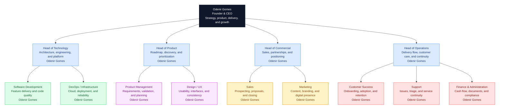

# About OGS Tech

## Mission

Technology that takes your business further.

---

## Purpose

We believe quality technology should not be a privilege of large companies.

---

## Vision

To be the largest technology company for small and medium businesses in Brazil.

---

## Values

We lead with ethics, we grow with people.

---

## Slogan

Your business. Further. Future.

---

## Organizational Chart

The chart below follows common organizational chart best practices: a clear top-down hierarchy, grouped responsibilities by area, and a short description inside each role card. At OGS Tech's current stage, all positions below are currently led by **Odenir Gomes**.

## Current Roles and Responsibilities

> At the current stage of OGS Tech, all roles below are currently occupied by **Odenir Gomes**, with external support added only when needed.

| Area | Role | Description | Current Collaborator |
|---|---|---|---|
| Leadership | Founder / CEO | Sets the company's direction and connects strategy with execution. | Odenir Gomes |
| Technology | Head of Technology | Oversees architecture, engineering quality, infrastructure, and technical decisions. | Odenir Gomes |
| Technology | Software Development | Builds and maintains the company's core products and services. | Odenir Gomes |
| Technology | DevOps / Infrastructure | Handles cloud setup, deployment flow, and operational reliability. | Odenir Gomes |
| Product | Head of Product | Defines roadmap priorities and aligns delivery with customer needs. | Odenir Gomes |
| Product | Product Management | Organizes requirements, validation, and execution priorities. | Odenir Gomes |
| Product | Design / UX | Improves usability, interfaces, and visual consistency. | Odenir Gomes |
| Commercial | Head of Commercial | Leads partnerships, proposals, and revenue generation efforts. | Odenir Gomes |
| Commercial | Sales | Qualifies opportunities, runs conversations, and closes deals. | Odenir Gomes |
| Commercial | Marketing | Strengthens positioning through content and digital presence. | Odenir Gomes |
| Operations | Head of Operations | Coordinates delivery flow, internal routines, and service continuity. | Odenir Gomes |
| Operations | Customer Success | Supports onboarding, adoption, and long-term customer value. | Odenir Gomes |
| Operations | Support | Receives requests, triages issues, and coordinates responses. | Odenir Gomes |
| Operations | Finance and Administration | Organizes financial and administrative routines and supports compliance. | Odenir Gomes |
