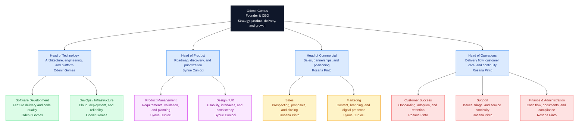

# About OGS Tech

## Mission

Technology that takes your business further.

---

## Purpose

We believe quality technology should not be a privilege of large companies.

---

## Vision

To be the largest technology company for small and medium businesses in Brazil.

---

## Values

We lead with ethics, we grow with people.

---

## Slogan

Your business. Further. Future Ready.

---

## Brand Umbrella

OGS Tech operates as a **brand umbrella**: three brands, one underlying technology, each a
different way of going to market.

| Brand | Role | Goes to market as |
|---|---|---|
| 🤝 **OGS Partners** | *premium, bespoke* | Engineering and Support services for partner companies (Alephee, Noordhen) |
| 🏭 **OGS Studio** | *scalable products* | Packaged products sold at scale (the Press, Royale IQ) |
| ⚙️ **OGS Engine** | *the machine room* | Builds the technology and executes Partners' projects (Press, Agent AI, Superset AI) |

➡️ Full picture: [Brand Architecture — the OGS umbrella](https://github.com/ogs-tech/.github/blob/main/docs/explanation/brand-architecture.md)

---

## Organizational Chart

The chart below follows common organizational chart best practices: a clear top-down hierarchy, grouped responsibilities by area, and a short description inside each role card. At OGS Tech's current stage, **Odenir Gomes** leads the Leadership, Technology, and Product areas, while **Rosana Pinto** leads the Commercial and Operations areas — with **Marketing** led by **Synue Cunioci**.

```mermaid
%%{init: {"flowchart": {"nodeSpacing": 55, "rankSpacing": 95, "diagramPadding": 28, "useMaxWidth": true}}}%%
flowchart TB

    CEO["Odenir Gomes<br/>Founder & CEO<br/>Strategy, product, delivery, and growth"]

    CEO --> TECH["Head of Technology<br/>Architecture, engineering, and platform<br/>Odenir Gomes"]
    CEO --> PRODUCT["Head of Product<br/>Roadmap, discovery, and prioritization<br/>Synue Cunioci"]
    CEO --> BUSINESS["Head of Commercial<br/>Sales, partnerships, and positioning<br/>Rosana Pinto"]
    CEO --> OPS["Head of Operations<br/>Delivery flow, customer care, and continuity<br/>Rosana Pinto"]

    TECH --> SDE["Software Development<br/>Feature delivery and code quality<br/>Odenir Gomes"]
    TECH --> DEVOPS["DevOps / Infrastructure<br/>Cloud, deployment, and reliability<br/>Odenir Gomes"]

    PRODUCT --> PM["Product Management<br/>Requirements, validation, and planning<br/>Synue Cunioci"]
    PRODUCT --> DESIGN["Design / UX<br/>Usability, interfaces, and consistency<br/>Synue Cunioci"]

    BUSINESS --> SALES["Sales<br/>Prospecting, proposals, and closing<br/>Rosana Pinto"]
    BUSINESS --> MKT["Marketing<br/>Content, branding, and digital presence<br/>Synue Cunioci"]

    OPS --> CS["Customer Success<br/>Onboarding, adoption, and retention<br/>Rosana Pinto"]
    OPS --> SUPPORT["Support<br/>Issues, triage, and service continuity<br/>Rosana Pinto"]
    OPS --> FIN["Finance & Administration<br/>Cash flow, documents, and compliance<br/>Rosana Pinto"]

    classDef founder fill:#0f172a,color:#ffffff,stroke:#0f172a,stroke-width:2px;
    classDef heads fill:#dbeafe,color:#1e3a8a,stroke:#60a5fa,stroke-width:1.5px;
    classDef tech fill:#dcfce7,color:#166534,stroke:#4ade80,stroke-width:1.5px;
    classDef product fill:#fae8ff,color:#86198f,stroke:#d946ef,stroke-width:1.5px;
    classDef growth fill:#fef3c7,color:#92400e,stroke:#f59e0b,stroke-width:1.5px;
    classDef ops fill:#fee2e2,color:#991b1b,stroke:#f87171,stroke-width:1.5px;

    class CEO founder;
    class TECH,PRODUCT,BUSINESS,OPS heads;
    class SDE,DEVOPS tech;
    class PM,DESIGN product;
    class SALES,MKT growth;
    class CS,SUPPORT,FIN ops;
```

## Current Roles and Responsibilities

> At the current stage of OGS Tech, the Leadership, Technology, and Product roles are currently occupied by **Odenir Gomes**, while the Commercial and Operations roles are occupied by **Rosana Pinto** — except **Marketing**, which is led by **Synue Cunioci**.

| Area | Role | Description | Current Collaborator |
|---|---|---|---|
| Leadership | Founder / CEO | Sets the company's direction and connects strategy with execution. | Odenir Gomes |
| Technology | Head of Technology | Oversees architecture, engineering quality, infrastructure, and technical decisions. | Odenir Gomes |
| Technology | Software Development | Builds and maintains the company's core products and services. | Odenir Gomes |
| Technology | DevOps / Infrastructure | Handles cloud setup, deployment flow, and operational reliability. | Odenir Gomes |
| Product | Head of Product | Defines roadmap priorities and aligns delivery with customer needs. | Synue Cunioci |
| Product | Product Management | Organizes requirements, validation, and execution priorities. | Synue Cunioci |
| Product | Design / UX | Improves usability, interfaces, and visual consistency. | Synue Cunioci |
| Commercial | Head of Commercial | Leads partnerships, proposals, and revenue generation efforts. | Rosana Pinto |
| Commercial | Sales | Qualifies opportunities, runs conversations, and closes deals. | Rosana Pinto |
| Commercial | Marketing | Strengthens positioning through content and digital presence. | Synue Cunioci |
| Operations | Head of Operations | Coordinates delivery flow, internal routines, and service continuity. | Rosana Pinto |
| Operations | Customer Success | Supports onboarding, adoption, and long-term customer value. | Rosana Pinto |
| Operations | Support | Receives requests, triages issues, and coordinates responses. | Rosana Pinto |
| Operations | Finance and Administration | Organizes financial and administrative routines and supports compliance. | Rosana Pinto |
