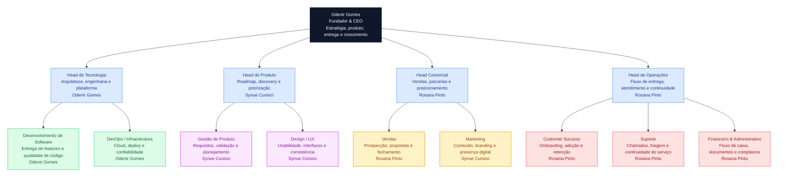

# Sobre a OGS Tech

[English](README.md) · **Português**

## Missão

Tecnologia que leva o seu negócio além.

---

## Propósito

Acreditamos que tecnologia de qualidade não deveria ser privilégio de grandes empresas.

---

## Visão

Ser a maior empresa de tecnologia para pequenas e médias empresas do Brasil.

---

## Valores

Lideramos com ética; crescemos com pessoas.

---

## Slogan

Seu negócio. Além. · Future Ready.

---

## Guarda-chuva de Marca

A OGS Tech opera como um **guarda-chuva de marca**: três marcas, uma tecnologia por baixo, cada uma
uma forma diferente de ir ao mercado.

| Marca | Papel | Vai ao mercado como |
|---|---|---|
| 🤝 **OGS Partners** | *premium, sob medida* | Serviços de Engenharia e Suporte para empresas parceiras (Alephee, Noordhen) |
| 🏭 **OGS Studio** | *produtos escaláveis* | Produtos empacotados, vendidos em escala (o Press, o Royale IQ) |
| ⚙️ **OGS Engine** | *a sala de máquinas* | Constrói a tecnologia e executa os projetos da Partners (Press, Agent AI, Superset AI) |

➡️ Quadro completo: [Arquitetura de Marca — o guarda-chuva OGS](https://github.com/ogs-tech/.github/blob/main/docs/explanation/brand-architecture.md)

---

## Organograma

O organograma abaixo segue boas práticas comuns: hierarquia clara de cima para baixo, responsabilidades agrupadas por área e uma descrição curta dentro de cada cartão de papel. No estágio atual da OGS Tech, **Odenir Gomes** lidera as áreas de Liderança, Tecnologia e Produto, enquanto **Rosana Pinto** lidera as áreas Comercial e de Operações — com **Marketing** liderado por **Synue Cunioci**.

## Papéis e Responsabilidades Atuais

> No estágio atual da OGS Tech, os papéis de Liderança, Tecnologia e Produto são ocupados por **Odenir Gomes**, enquanto os papéis Comercial e de Operações são ocupados por **Rosana Pinto** — exceto **Marketing**, liderado por **Synue Cunioci**.

| Área | Papel | Descrição | Colaborador atual |
|---|---|---|---|
| Liderança | Fundador / CEO | Define a direção da empresa e conecta estratégia com execução. | Odenir Gomes |
| Tecnologia | Head de Tecnologia | Cuida de arquitetura, qualidade de engenharia, infraestrutura e decisões técnicas. | Odenir Gomes |
| Tecnologia | Desenvolvimento de Software | Constrói e mantém os produtos e serviços core da empresa. | Odenir Gomes |
| Tecnologia | DevOps / Infraestrutura | Cuida do setup de cloud, do fluxo de deploy e da confiabilidade operacional. | Odenir Gomes |
| Produto | Head de Produto | Define as prioridades do roadmap e alinha a entrega às necessidades do cliente. | Synue Cunioci |
| Produto | Gestão de Produto | Organiza requisitos, validação e prioridades de execução. | Synue Cunioci |
| Produto | Design / UX | Melhora usabilidade, interfaces e consistência visual. | Synue Cunioci |
| Comercial | Head Comercial | Lidera parcerias, propostas e esforços de geração de receita. | Rosana Pinto |
| Comercial | Vendas | Qualifica oportunidades, conduz conversas e fecha negócios. | Rosana Pinto |
| Comercial | Marketing | Fortalece o posicionamento por meio de conteúdo e presença digital. | Synue Cunioci |
| Operações | Head de Operações | Coordena o fluxo de entrega, as rotinas internas e a continuidade do serviço. | Rosana Pinto |
| Operações | Customer Success | Apoia onboarding, adoção e valor de longo prazo para o cliente. | Rosana Pinto |
| Operações | Suporte | Recebe solicitações, faz triagem de problemas e coordena respostas. | Rosana Pinto |
| Operações | Financeiro e Administrativo | Organiza rotinas financeiras e administrativas e apoia o compliance. | Rosana Pinto |
